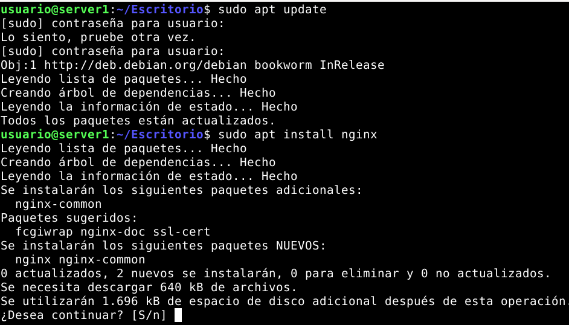
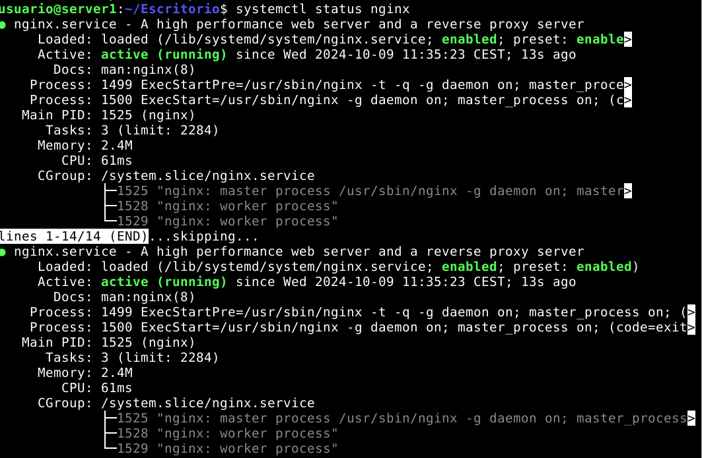
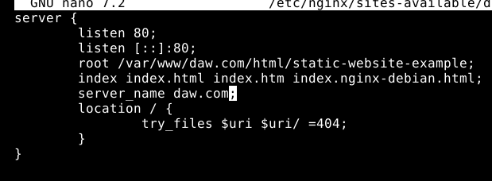
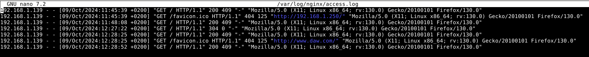
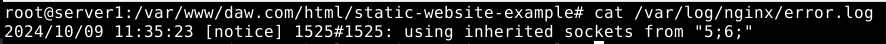
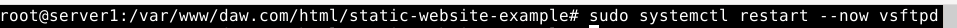
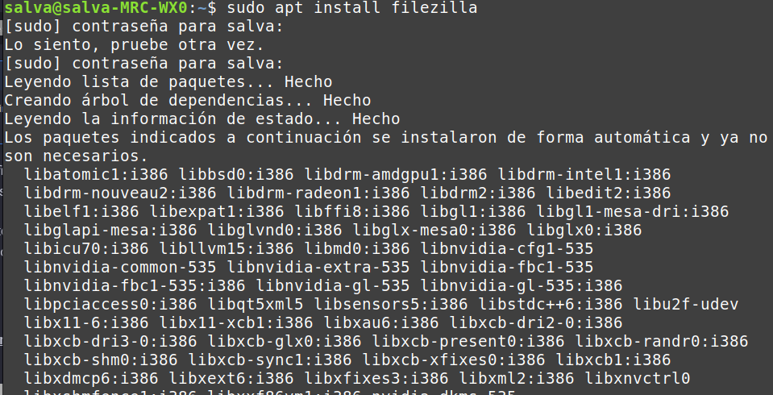
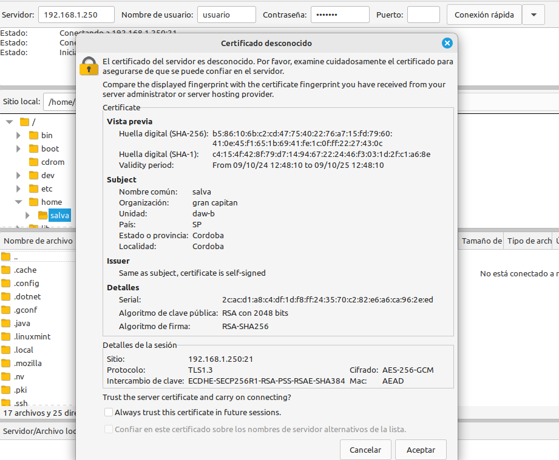
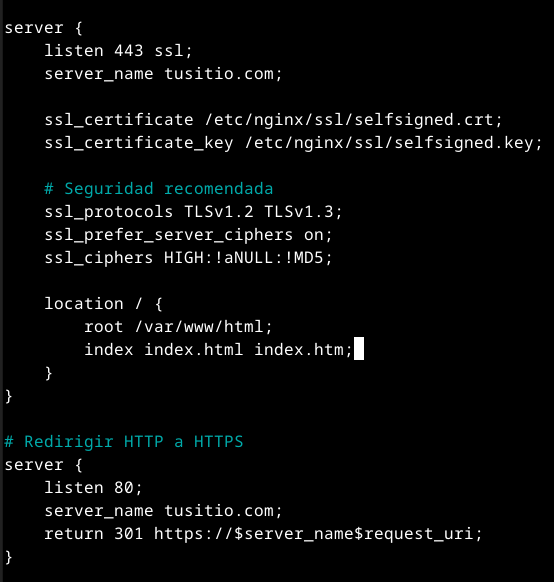

# Práctica 2.1 - Instalación y configuración de un servidor web Nginx

## Instalación del servidor

Lo primero que hice actualizar los repositorios he instalar nginx



Comprobamos que esté bien instalada



Ahora creamos la carpeta del sitio web y clonamos el repositorio https://github.com/cloudacademy/static-website-example para poder realizar las pruebas.


Clonamos


Ahora nos aseguramos que el usuario del servicio web pueda acceder a la carpeta donde está alojado el servidor.


Por último comprobamos que si entramos a la ip de la máquina esta de servicio. En mi caso, en la wifi de mi casa era 192.168.1.250


## Configuración del servidor web

Ahora abordamos la correcta configuración del servidor. Para ello creamos un archivo de configuración en la ruta sudo nano /etc/nginx/sites-available/vuestro_dominio y configuramos el archivo.




Cuidado que la directiva root debe de tener la ruta absoluta del archivo index.html

Ahora creamos un archivo simbólico entre este archivo y el de sitios que están habilitados. Esto es para que el servidor sepa que nuestro sitio web está habilitado.


Por último reiniciamos el servicio.


Ahora comprobamos que todo haya sido configurado correctamente. Primero antes de nada modificaremos el archivo /etc/hosts para que nuestra máquina anfitriona asocie la IP de la máquina virtual con el nombre del servidor


Para terminar esta parte comprobaremos los registros del servidor. Miraremos primero el log de las peticiones correctas y después las incorrectas, para ver si se registran correctamente.



EL de las incorrectas



## FTP

Lo primero que debemos de hacer es descargar vsftpd


Ahora creamos el directorio donde vamos a copiar las cosas y creamos los certificados de seguridad necesarios


Ahora vamos al archivo de configuración y después de eliminar las siguientes lineas: 

```
rsa_cert_file=/etc/ssl/certs/ssl-cert-snakeoil.pem
rsa_private_key_file=/etc/ssl/private/ssl-cert-snakeoil.key
ssl_enable=NO
```

añadimos:


Después reiniciamos el servicio e instalamos filezilla





Ahora entramos en el filezilla. Para conectarnos en la parte de servidor ponemos la ip de este, después el nombre del usuario con el que accedemos. Si entramos por el puerto 22 que es el de SFTP no hace falta poner contraseña. Esto es porque el servidor ya tiene mi clave pública ssh. 



Como vemos sale el certificado que hemos configurado antes con openssl. Ahora transferimos un archivo para hacer la comprobación de que funciona bien.


## HTTPS

Para esto tenemos que generar otro grupo de claves ssl y creamos un directorio que las contenga


Generamos la clave


Modificamos el archivo de configuración de Nginx para que oiga las peticiones al puerto 443 y redireccionamos las peticiones del puerto 80. 



Por último comprobamos que funcione


